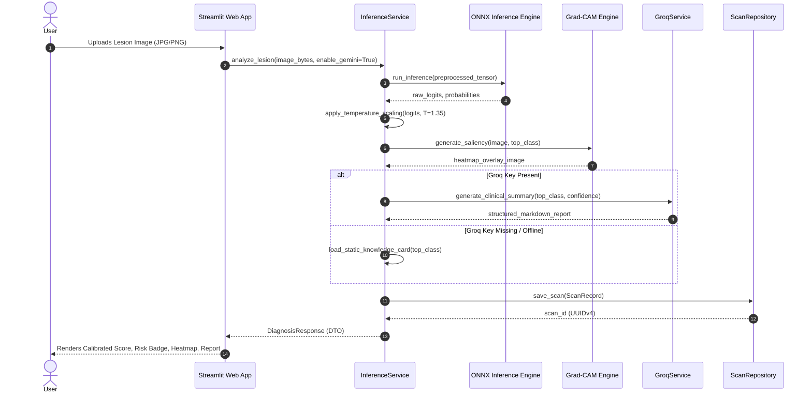

# Architecture & Technical Blueprint — DermAssist AI

> **Status**: Approved  
> **System Archetype**: Web / Machine Learning Inference System (Archetypes 5 & 6)  
> **Functional Requirements**: Defined in [`PRD.md`](./PRD.md) | Repo Rules in [`../AGENTS.md`](../AGENTS.md)  
> **Last Updated**: 2026-09-27  

---

## 1. System Topology & Architectural Overview

DermAssist AI separates training, model serving, database persistence, and presentation into decoupled, single-responsibility layers adhering to the **Strict One-Way Dependency Law**.

```
┌────────────────────────────────────────────────────────────────────────┐
│                        USER PRESENTATION LAYER                         │
│       Streamlit Web Application / Optional REST Client                 │
│              (Image Upload, Heatmap Render, Report Card)               │
└───────────────────────────────────┬────────────────────────────────────┘
                                    │ (Typed DTOs / Request)
                                    ▼
┌────────────────────────────────────────────────────────────────────────┐
│                        APPLICATION SERVICE LAYER                       │
│    InferenceService         ReportService           HistoryService     │
│   (Orchestrates Model)   (Groq Advisory Adapter)  (Scan Persistence)    │
└───────────┬───────────────────────┬───────────────────────┬────────────┘
            │                       │                       │
            ▼                       ▼                       ▼
┌──────────────────────┐  ┌──────────────────┐  ┌──────────────────────┐
│  CORE DOMAIN ENGINE  │  │ EXTERNAL ADAPTER │  │ INFRASTRUCTURE LAYER │
│ • ONNX Inference     │  │ • Groq LPU API │  │ • ScanRepository     │
│ • Temperature Scaling│  │ • Static Cards   │  │ • Supabase Cloud DB  │
│ • Grad-CAM Heatmaps  │  └──────────────────┘  │ • Supabase Storage   │
│ • 7-Class Vocabulary │                        └──────────────────────┘
└──────────────────────┘
```

### Mermaid Sequence: Diagnostic Scan Lifecycle


---

## 2. Core Architectural Invariants

1. **Strict One-Way Dependency Flow**:
   $$\text{Streamlit UI} \longrightarrow \text{Services} \longrightarrow \text{Core Domain / Algorithmic Engine} \longrightarrow \text{Infrastructure / Adapters}$$
   The UI never touches raw tensors, database connections, or HTTP sockets directly.
2. **Vendor Decoupling Seams**:
   - Model inference is encapsulated in an `InferenceEngine` interface. Model inference is strictly executed via the lightweight `ONNXInferenceEngine` (< 250ms on CPU).
   - LLM generation is behind `ClinicalAdvisorAdapter`. If the Groq API fails, it automatically falls back to static verified knowledge cards.
3. **Zero Patient-Level Data Leakage Invariant**:
   All training and validation pipelines enforce grouping by `lesion_id` using `StratifiedGroupKFold`. An automated test gate blocks any release where $\text{TrainLesions} \cap \text{ValLesions} \neq \emptyset$.
4. **Post-Hoc Probability Calibration**:
   Raw model logits must pass through temperature scaling ($z / T^*$) before presentation. Uncalibrated raw softmax scores are strictly prohibited in the user interface.
5. **Fail-Safe Clinical Disclaimer**:
   The mandatory medical disclaimer cannot be dismissed, hidden, or toggled off via UI flags.
6. **Non-Blocking Storage Logging**:
   Database errors during scan history saves must never crash or interrupt the user's primary inference result.

---

## 3. Technology Stack & Version Locks

| Layer | Technology | Version | Rationale |
|---|---|---|---|
| **Language Runtime** | Python | `3.10+` | Lightweight runtime for ONNX, OpenCV, and scientific packages |
| **Inference Engine** | `onnxruntime` | `^1.17.0` | Ultra-fast CPU inference (< 250ms), lightweight (~15MB install) |
| **Model Artifact** | Pretrained EfficientNet-B4 (ONNX) | ONNX v1.17 | Quantized/optimized model weights, zero local training required |
| **Explainability (XAI)** | OpenCV & NumPy (`opencv-python-headless`) | `^4.8.0` | Saliency overlay & heatmap blending |
| **Clinical Intelligence**| Groq LPU API (`groq`) | `^0.1.1` | Free-tier Groq Llama 3.3 70B for structured patient advice |
| **Cloud Database** | Supabase (`supabase-py`) | Cloud Serverless | Cloud-hosted PostgreSQL, zero local database storage |
| **Cloud Media Storage** | Supabase Storage (`scans` bucket) | Cloud Object Store | Remote image & heatmap storage, zero local disk files |
| **Remote Model Stream** | HuggingFace Hub (`huggingface_hub`) | Cloud Artifact | Dynamic model streaming on boot, zero local weight files |
| **Web Presentation** | Streamlit | `^1.32.0` | Python-native, reactive, interactive medical dashboard |

---

## 4. Storage Schemas & Database Entities

All database entities enforce UUID primary keys and ISO 8601 UTC timestamps.

### 4.1 Schema Definition (Supabase PostgreSQL)

```sql
-- Scans Table: Persistent record of diagnostic runs
CREATE TABLE IF NOT EXISTS scans (
    id TEXT PRIMARY KEY,                 -- UUIDv4
    image_hash TEXT NOT NULL,           -- SHA-256 hash of uploaded image
    predicted_class TEXT NOT NULL,      -- Diagnostic code: akiec, bcc, bkl, df, mel, nv, vasc
    raw_confidence REAL NOT NULL,       -- Uncalibrated max softmax (0.0 to 1.0)
    calibrated_confidence REAL NOT NULL,-- Temperature-scaled confidence (0.0 to 1.0)
    temperature REAL NOT NULL,          -- Optimal temperature scalar used (e.g. 1.35)
    uncertainty_score REAL,             -- Predictive entropy (if MC Dropout enabled)
    risk_level TEXT NOT NULL,           -- BENIGN, POTENTIALLY_MALIGNANT, MALIGNANT
    gemini_summary TEXT,                -- Generated clinical report
    feedback TEXT,                      -- User / Doctor feedback: CORRECT, INCORRECT, UNCERTAIN
    created_at TEXT NOT NULL            -- ISO-8601 UTC timestamp
);

CREATE INDEX IF NOT EXISTS idx_scans_created_at ON scans(created_at);
CREATE INDEX IF NOT EXISTS idx_scans_predicted_class ON scans(predicted_class);
```

### 4.2 7-Class Canonical Diagnostic Domain

```python
DIAGNOSIS_CLASSES = {
    "akiec": {"name": "Actinic Keratoses", "risk": "POTENTIALLY_MALIGNANT", "code": "akiec"},
    "bcc":   {"name": "Basal Cell Carcinoma", "risk": "MALIGNANT", "code": "bcc"},
    "bkl":   {"name": "Benign Keratosis-like Lesions", "risk": "BENIGN", "code": "bkl"},
    "df":    {"name": "Dermatofibroma", "risk": "BENIGN", "code": "df"},
    "mel":   {"name": "Melanoma", "risk": "MALIGNANT", "code": "mel"},
    "nv":    {"name": "Melanocytic Nevi", "risk": "BENIGN", "code": "nv"},
    "vasc":  {"name": "Vascular Lesions", "risk": "BENIGN", "code": "vasc"}
}
```

---

## 5. Internal Application Modular Blueprint (`src/` Layering)

```text
src/
├── domain/                      # Pure business rules & schemas (Zero IO / Zero framework imports)
│   ├── models.py                # PredictionResult, DiagnosisClass, ScanRecord dataclasses
│   └── knowledge_cards.py       # 7-Class static clinical cards & permanent disclaimers
├── core/                        # Mathematical & Algorithmic Engines
│   ├── dataset.py               # HAM10000Dataset with StratifiedGroupKFold split logic
│   ├── onnx_engine.py           # ONNX Runtime session & tensor pre/post-processing
│   ├── calibration.py           # Temperature scaling solver & ECE computation
│   ├── uncertainty.py           # Monte Carlo Dropout predictive entropy engine
│   └── explainability.py        # Grad-CAM heatmap extraction
├── services/                    # Application Orchestration
│   ├── inference_service.py     # Main facade coordinating preprocessing, ONNX, and CAM
│   ├── groq_service.py        # Groq Llama 3.3 70B client with retry and fallback
│   └── history_service.py       # Scan repository management
└── infrastructure/              # External Adapters
    ├── onnx_engine.py           # ONNX Runtime session & fast tensor processing
    └── supabase_repo.py         # Supabase Database & Storage Cloud Repository
```

---

## 6. Deployment Runbook & Operational Verification

### 6.1 Environment Variables
| Variable Name | Required? | Default | Description |
|---|---|---|---|
| `GROQ_API_KEY` | Optional | `None` | Groq API key for dynamic clinical summaries |
| `SUPABASE_URL` | Required | `https://xyz.supabase.co` | Supabase Cloud Project URL |
| `SUPABASE_KEY` | Required | `eyJ...` | Supabase Anon/Service API Key |
| `HF_MODEL_REPO` | Optional | `None` | HuggingFace Hub repo ID for streaming ONNX model weights |
| `MODEL_PATH` | Optional | `checkpoints/efficientnet_b4.onnx`| Path to optimized ONNX model weights |
| `APP_PORT` | Optional | `8501` | Streamlit server port |

### 6.2 Operational Healthcheck Probe
```bash
# Verify app is responding and model weights are initialized
curl -sI http://localhost:8501/_stcore/health
```

---

## 7. Architectural Decisions & Technical Trade-offs (ADR Log)

| Decision ID | Context | Options Considered | Chosen Option & Rationale | Reversal Trigger |
|---|---|---|---|---|
| **ADR-01** | Production Model Runtime | A: Heavy DL Framework<br>B: Dedicated ONNX Runtime | **Option B (ONNX Runtime)**: Sub-250ms CPU execution with ultra-small ~15MB install footprint. | If quantization degrades Melanoma Recall by > 1.5%. |
| **ADR-02** | LLM Advisory Engine | A: Local LLM (Ollama)<br>B: Static Cards Only<br>C: Hybrid (Groq Llama 3.3 70B + Static Fallback) | **Option C (Hybrid)**: Delivers instant doctor-level insights with zero GPU overhead; 100% resilient if offline. | If Groq pricing introduces unexpected costs. |
| **ADR-03** | Data Persistence Engine | A: Traditional File-based Storage<br>B: Supabase (Cloud PostgreSQL + Storage) | **Option B (Supabase)**: 100% Stateless Cloud-First architecture. All scans, images, and heatmaps stored in Supabase Cloud DB and Storage buckets. | If fully offline air-gapped deployment is required. |
